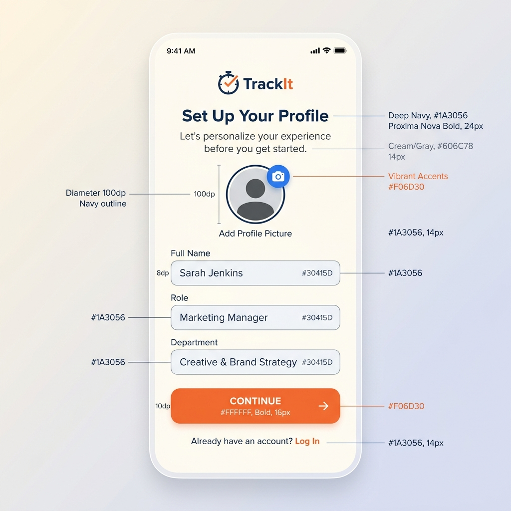
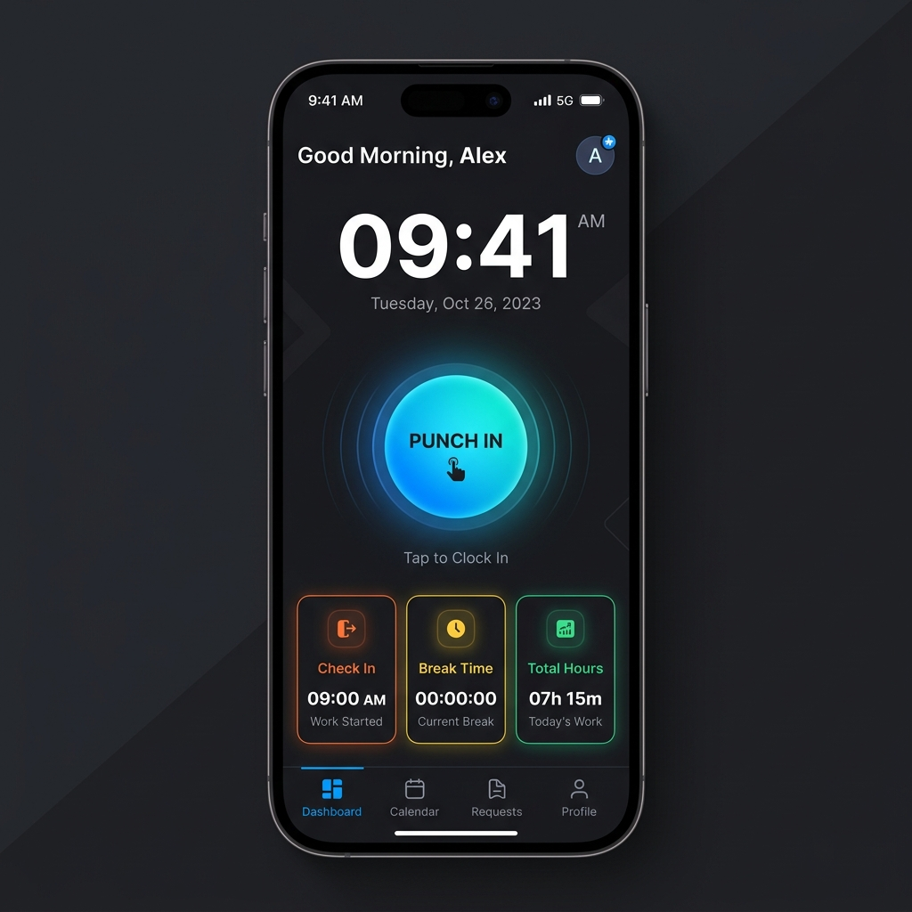
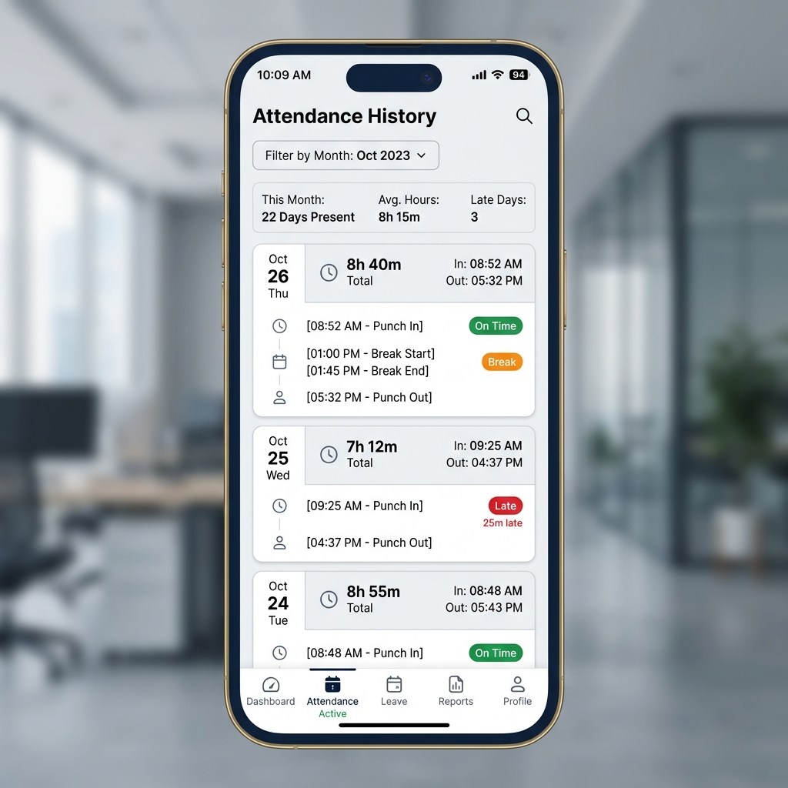

# Work-Time-Logger ⏱️

A premium, high-fidelity Office Attendance & Time Tracking application built with **React Native** and **Expo**. Designed for efficiency, accuracy, and a superior user experience.

---

## 📱 App Previews

<p align="center">
  
  
  
</p>

---

## ✨ Features

### 🚀 Seamless Onboarding
- **Personalized Profile**: Set up your avatar, name, role, and department.
- **Custom Work Schedules**: Configure total office hours, required duty hours, and active work days.

### ⚡ Real-Time Attendance Tracking
- **Multi-State Punch Button**: Intuitively transition between *Punch In*, *Break*, and *Resume*.
- **Safe Punch-Out**: Prevent accidental exits with a 5-second hold-to-confirm mechanism.
- **Live Overtime Tracking**: Automatically calculates and displays remaining time or overtime in real-time.

### 📊 Insightful Statistics
- **Daily Metrics**: Instant visibility into Check-In time, Total Break duration, and Net Work Hours.
- **Attendance History**: (Coming Soon) Detailed logs of daily performance and consistency.

### 🎨 Premium Design System
- **Modern Aesthetics**: Vibrant gradients, glassmorphic cards, and a sleek dark-themed interface.
- **Dynamic Feedback**: Integrated haptics and smooth micro-animations for every interaction.

---

## 🛠️ Technical Architecture

### Tech Stack
- **Framework**: [Expo](https://expo.dev/) (SDK 51+)
- **Navigation**: [Expo Router](https://docs.expo.dev/router/introduction/) (File-based routing)
- **Language**: TypeScript
- **State Persistence**: [AsyncStorage](https://react-native-async-storage.github.io/async-storage/)
- **Animations**: React Native Reanimated
- **Icons**: Lucide React Native

### Core Tech Flows

#### 1. Onboarding & Initialization
When a user first opens the app, the `OnboardingScreen` guides them through profile creation.
- **Flow**: `Step 1 (Profile)` ➡️ `Step 2 (Settings)` ➡️ `Finish`.
- **Persistence**: Data is saved to `USER_PROFILE` and `USER_SETTINGS` keys. The `ONBOARDING_COMPLETE` flag ensures users aren't prompted again.

#### 2. The Attendance Lifecycle
The application manages four primary states: `idle`, `in`, `break`, and `out`.
- **Timer Logic**: A global 1-second interval updates the `elapsed` time and `totalBreak` duration based on the timestamps stored in state.
- **Auto-Save**: Every state change (Punch In, Start Break, etc.) is immediately synchronized with `AsyncStorage` to prevent data loss on app restart.

#### 3. Dynamic Calculation
- **Net Hours**: `(Current Time - Check-In Time) - Total Break Duration`.
- **Remaining Time**: Calculates the gap between `Net Hours` and the user's defined `Duty Hours`.

---

## 🚀 Getting Started

### Prerequisites
- Node.js (v18+)
- Expo Go app on your mobile device (or an emulator)

### Installation
1. Clone the repository:
   ```bash
   git clone https://github.com/jithinbinoy2000/Work-Time-Logger.git
   ```
2. Install dependencies:
   ```bash
   npm install
   ```
3. Start the development server:
   ```bash
   npx expo start
   ```

---

## 📜 Copyright & Attribution
The design and UI assets used in this project are custom-generated for this implementation. All original logic and code are the property of the developer. If you intend to use the visual design for commercial purposes, please ensure compliance with appropriate creative licenses.
